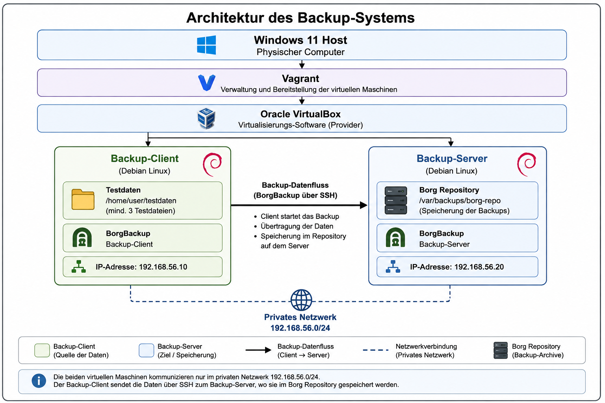

# Projektspezifikation

## Automatisiertes Backup-System mit BorgBackup

**Autor:** Christian Abbühl  
**Klasse:** B-TIP-24-T-a  
**Modul:** Netzwerkbetriebssysteme  
**Dozent:** Oliver Büchel  
**Schule:** TEKO Schweizerische Fachschule Bern  

---

## 1. Ausgangslage und Lernziel

Backups sind ein wichtiger Bestandteil beim Betrieb von Serversystemen. Eine Datensicherung ist jedoch nur dann sinnvoll, wenn sie regelmässig durchgeführt wird und die gesicherten Daten im Fehlerfall zuverlässig wiederhergestellt werden können.

Im Rahmen dieses Projekts möchte ich erarbeiten, wie ein automatisiertes Backup-System für Linux-Systeme aufgebaut und betrieben werden kann. Dabei möchte ich insbesondere lernen, wie mit **BorgBackup** Daten eines Debian-Systems über das Netzwerk auf einem separaten Backup-Server gesichert werden können.

Neben der eigentlichen Datensicherung möchte ich mich mit der Automatisierung des Backup-Prozesses beschäftigen. Dazu gehören die regelmässige automatische Erstellung von Backups, die Begrenzung und Rotation der Sicherungsstände sowie die Wiederherstellung von gesicherten Dateien.

Als Testumgebung werden zwei Debian-Systeme verwendet. Ein System übernimmt die Rolle des Backup-Clients und das zweite System dient als Backup-Server. Die Systeme werden als virtuelle Maschinen betrieben, damit das Projekt in einer abgegrenzten und reproduzierbaren Umgebung umgesetzt und getestet werden kann.

## 2. Projektziel

Ziel des Projekts ist die Konzeption und Umsetzung eines automatisierten Backup-Systems mit **BorgBackup**. Das System soll ein definiertes Verzeichnis eines Debian-Clients über das Netzwerk auf einem separaten Debian-Backup-Server sichern.

Auf dem Backup-Client wird das Verzeichnis `/home/user/testdaten` als zu sicherndes Verzeichnis verwendet. Für die Testumgebung enthält dieses Verzeichnis mindestens drei Dateien mit einer gesamten Datenmenge von mindestens **100 MB**.

Das Backup soll automatisch **alle 15 Minuten** ausgeführt werden. Dieser kurze Intervall wurde gewählt, da die virtuellen Maschinen nur während der Arbeit am Projekt betrieben werden und nicht dauerhaft oder über Nacht eingeschaltet sind. Dadurch können die automatische Ausführung und die Rotation der Backups innerhalb einer Unterrichts- oder Testsitzung überprüft werden.

Für die Ausführung des Backups wird ein Bash-Skript verwendet, sodass keine manuelle Eingabe der einzelnen BorgBackup-Befehle notwendig ist.

Damit die Anzahl der Sicherungsstände nicht unkontrolliert anwächst, werden maximal **30 Backup-Archive** aufbewahrt. Sobald mehr als 30 Archive vorhanden sind, werden die ältesten Archive automatisch entfernt.

Neben der Erstellung der Backups ist auch die Wiederherstellung Bestandteil des Projekts. Eine zuvor gesicherte und anschliessend gelöschte Testdatei soll aus einem vorhandenen Backup wiederhergestellt werden können.

Die benötigte Testumgebung besteht aus zwei Debian-Systemen, die als virtuelle Maschinen betrieben werden. Die Bereitstellung der virtuellen Maschinen soll reproduzierbar erfolgen.

Das Projekt gilt als erfolgreich umgesetzt, wenn folgende Hauptziele erreicht sind:

- Zwei getrennte Debian-Systeme stehen als Backup-Client und Backup-Server zur Verfügung.
- Der Backup-Client kann eine SSH-Verbindung zum Backup-Server herstellen.
- Das Verzeichnis `/home/user/testdaten` mit mindestens drei Dateien und mindestens 100 MB Daten kann gesichert werden.
- Das Backup wird automatisch alle 15 Minuten ausgeführt.
- Es werden maximal 30 Backup-Archive aufbewahrt.
- Ältere Archive werden bei Überschreiten der definierten Anzahl automatisch entfernt.
- Eine gelöschte Testdatei kann erfolgreich aus einem Backup wiederhergestellt werden.

## 3. Architektur

Die Testumgebung wird auf einem Windows-11-Host betrieben. Darauf werden mit **Vagrant** und **Oracle VirtualBox** zwei virtuelle Debian-Systeme bereitgestellt.

Die beiden virtuellen Maschinen befinden sich in einem privaten Netzwerk und übernehmen folgende Rollen:

- **Backup-Client:** Enthält die zu sichernden Testdaten und initiiert den Backup-Prozess.
- **Backup-Server:** Stellt das BorgBackup-Repository zur Speicherung der Backup-Archive bereit.

Für die beiden Systeme werden folgende IP-Adressen vorgesehen:

| System | IP-Adresse | Aufgabe |
|---|---|---|
| Backup-Client | `192.168.56.10` | Quelle der zu sichernden Daten und Initiierung des Backups |
| Backup-Server | `192.168.56.20` | Speicherung der BorgBackup-Archive |

Die Kommunikation für den Backup-Prozess erfolgt in Richtung **Backup-Client → Backup-Server**.

Die SSH-Verbindung vom Backup-Client zum Backup-Server ist notwendig, weil der Backup-Prozess auf dem Client initiiert wird. Das Backup-Skript und BorgBackup werden auf dem Backup-Client ausgeführt. BorgBackup verbindet sich von dort über SSH mit dem entfernten BorgBackup-Repository auf dem Backup-Server und überträgt die zu sichernden Daten.

Der Backup-Server stellt somit das Ziel der Sicherung bereit, startet den eigentlichen Backup-Prozess jedoch nicht selbst. Eine vom Backup-Server initiierte SSH-Verbindung zum Backup-Client ist für den Backup-Prozess nicht vorgesehen.

Die geplante Architektur wird in folgendem Schema dargestellt:

  

## 4. Anforderungen und messbare Ziele

Die folgenden Anforderungen definieren die Funktionen, welche das Backup-System nach der Umsetzung erfüllen muss.

### 4.1 Reproduzierbare Testumgebung

Die beiden Debian-Systeme sollen als virtuelle Maschinen reproduzierbar bereitgestellt werden können.

**Messbares Ziel:** Es stehen zwei getrennte Debian-Systeme mit den Rollen `backup-client` und `backup-server` zur Verfügung.

### 4.2 Netzwerkkommunikation

Die für das Backup benötigte Netzwerkverbindung wird vom Backup-Client zum Backup-Server aufgebaut.

Der Grund für diese Kommunikationsrichtung liegt darin, dass der Backup-Prozess auf dem Backup-Client gestartet wird. BorgBackup muss deshalb vom Client aus das entfernte Repository auf dem Backup-Server erreichen können. Die Verbindung zum Repository erfolgt über **SSH**.

**Messbares Ziel:** Der Backup-Client mit der IP-Adresse `192.168.56.10` kann eine SSH-Verbindung zum Backup-Server unter `192.168.56.20` herstellen. Für den Backup-Prozess ist keine vom Backup-Server initiierte SSH-Verbindung zum Backup-Client erforderlich.

### 4.3 Zu sichernde Daten

Auf dem Backup-Client wird ausschliesslich das Verzeichnis `/home/user/testdaten` gesichert.

Das Testverzeichnis enthält:

- mindestens **3 Testdateien**
- insgesamt mindestens **100 MB Daten**

Andere Verzeichnisse oder Laufwerke sind nicht Bestandteil der Datensicherung.

**Messbares Ziel:** Alle Dateien innerhalb von `/home/user/testdaten` werden durch BorgBackup erfasst und in einem Backup-Archiv auf dem Backup-Server gespeichert.

### 4.4 Backup-Häufigkeit

Das Backup soll automatisch **alle 15 Minuten** durchgeführt werden.

Der kurze Backup-Intervall wird für die Testumgebung verwendet, da die virtuellen Maschinen nicht dauerhaft betrieben werden. Dadurch können während einer Testsitzung mehrere automatische Backup-Durchläufe erzeugt und überprüft werden.

Für die Sicherung gelten folgende Parameter:

- **Häufigkeit:** alle 15 Minuten
- **Quelle:** `/home/user/testdaten`
- **Ziel:** BorgBackup-Repository auf dem Backup-Server
- **Maximale Anzahl Backup-Archive:** 30

**Messbares Ziel:** Der Backup-Prozess ist so konfiguriert, dass bei laufenden virtuellen Maschinen alle 15 Minuten automatisch ein neues Backup erstellt wird.

### 4.5 Automatisierung

Der Backup-Vorgang wird mit einem Bash-Skript automatisiert. Das Skript führt die für die Datensicherung benötigten BorgBackup-Befehle aus.

Für die reguläre Durchführung eines Backups sollen keine einzelnen BorgBackup-Befehle manuell eingegeben werden müssen.

**Messbares Ziel:** Durch die automatische Ausführung des Bash-Skripts wird ohne Benutzereingabe ein neues Backup-Archiv auf dem Backup-Server erstellt.

### 4.6 Aufbewahrung und Rotation

Auf dem Backup-Server werden maximal **30 Backup-Archive** aufbewahrt.

Sobald durch einen neuen Backup-Durchlauf mehr als 30 Archive vorhanden wären, werden die ältesten Archive automatisch entfernt. Dadurch wird verhindert, dass die Anzahl der Sicherungsstände und damit der benötigte Speicherplatz unkontrolliert anwachsen.

Bei einem Backup-Intervall von 15 Minuten entsprechen 30 Sicherungsstände bei durchgehend laufenden Systemen einer Backup-Historie von ungefähr **7 Stunden und 30 Minuten**.

Da die virtuellen Maschinen in der Testumgebung nicht dauerhaft laufen, bezieht sich diese Zeitspanne nur auf die tatsächlichen Betriebszeiten der virtuellen Maschinen.

**Messbares Ziel:** Nach Anwendung der Rotation befinden sich maximal 30 Backup-Archive im BorgBackup-Repository. Wird ein weiteres Backup erstellt, wird der älteste nicht mehr benötigte Sicherungsstand entfernt.

### 4.7 Wiederherstellung

Eine zuvor gesicherte Datei muss aus einem vorhandenen BorgBackup-Archiv wiederhergestellt werden können.

**Messbares Ziel:** Eine Testdatei aus `/home/user/testdaten` wird nach einem erfolgreichen Backup auf dem Client gelöscht und anschliessend aus einem BorgBackup-Archiv wiederhergestellt. Dateiname und Dateiinhalt müssen dem ursprünglichen Zustand entsprechen.

## 5. Test und Verifikation

Die definierten Anforderungen werden nach der Umsetzung mit konkreten Tests überprüft.

| Nr. | Test | Durchführung | Erwartetes Ergebnis |
|---|---|---|---|
| 1 | Testumgebung | Beide virtuellen Maschinen werden gestartet. | `backup-client` und `backup-server` sind als getrennte Debian-Systeme verfügbar. |
| 2 | Netzwerk | Vom Backup-Client wird eine SSH-Verbindung zu `192.168.56.20` aufgebaut. | Der Client kann die SSH-Verbindung zum Backup-Server erfolgreich herstellen. |
| 3 | Testdaten | Inhalt und Grösse von `/home/user/testdaten` werden kontrolliert. | Das Verzeichnis enthält mindestens 3 Dateien mit insgesamt mindestens 100 MB Daten. |
| 4 | Backup | Das Testverzeichnis wird mit BorgBackup gesichert. | Ein neues BorgBackup-Archiv enthält die definierten Testdateien. |
| 5 | Automatisierung | Die automatische Ausführung des Backup-Skripts wird überprüft. | Das Backup wird ohne Benutzereingabe ausgeführt. |
| 6 | Zeitsteuerung | Die virtuellen Maschinen bleiben für mindestens 30 Minuten in Betrieb. | Innerhalb dieses Zeitraums werden entsprechend dem 15-Minuten-Intervall automatische Backups ausgeführt. |
| 7 | Rotation | Es werden mehr als 30 Backup-Archive erzeugt bzw. die Rotation mit einer entsprechenden Anzahl Archive getestet. | Nach der Rotation befinden sich maximal 30 Backup-Archive im Repository. |
| 8 | Restore | Eine gesicherte Testdatei wird gelöscht und aus einem Backup wiederhergestellt. | Die Datei ist wieder vorhanden und entspricht in Dateiname und Inhalt dem ursprünglichen Zustand. |

Durch diese Tests kann für jede zentrale Anforderung überprüft werden, ob das definierte Ziel erreicht wurde.

## 6. Abgrenzung

Der Schwerpunkt des Projekts liegt auf dem Aufbau und der Funktionsprüfung eines einfachen automatisierten Backup-Systems für Dateien.

Um den Umfang des Projekts realistisch zu halten, sind folgende Punkte nicht Bestandteil des Projekts:

- keine Sicherung weiterer Verzeichnisse oder Laufwerke ausser `/home/user/testdaten`
- keine Sicherung von Datenbanken
- keine Sicherung von Containern
- keine Cloud-Infrastruktur
- keine grafische Benutzeroberfläche
- keine Hochverfügbarkeitslösung
- keine Sicherung mehrerer Clients
- kein Einsatz in einer produktiven Umgebung

Das Projekt beschränkt sich auf zwei Debian-Systeme und die Sicherung des definierten Testverzeichnisses `/home/user/testdaten`. Im Mittelpunkt stehen die automatische Sicherung im 15-Minuten-Intervall, die Begrenzung auf maximal 30 Sicherungsstände sowie die erfolgreiche Wiederherstellung von Dateien.